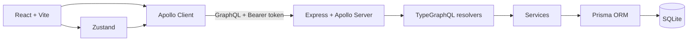

# MindShare

O MindShare é uma aplicação web colaborativa para registrar, discutir e priorizar ideias. O projeto foi desenvolvido como estudo de uma arquitetura full stack com GraphQL, reunindo uma interface em React e uma API Node.js com schema tipado no backend.

Usuários autenticados podem publicar ideias, consultar detalhes, comentar e votar. A API também mantém usuários e papéis de acesso, criando uma base para evoluir o produto com regras de autorização mais específicas.

## Funcionalidades

- Cadastro e login com senha hasheada pelo bcryptjs e autenticação JWT.
- Rotas públicas e protegidas no frontend.
- Criação, listagem, consulta, edição e exclusão de ideias pela API.
- Comentários vinculados à ideia e ao autor.
- Voto único por usuário e ideia, com ação de votar ou remover o voto.
- Contagem de votos por ideia.
- Gerenciamento de usuários e papéis `owner`, `admin`, `member` e `viewer` pela API.
- Persistência local com SQLite e migrations do Prisma.
- Schema GraphQL gerado automaticamente pelo TypeGraphQL.

## Tecnologias

| Camada | Tecnologias principais |
| --- | --- |
| Frontend | React 19, TypeScript, Vite, React Router e Zustand |
| Interface | Tailwind CSS, Base UI, Lucide e Sonner |
| Cliente GraphQL | Apollo Client |
| Backend | Node.js, Express 5, TypeScript e Apollo Server |
| GraphQL | TypeGraphQL e GraphQL.js |
| Dados | Prisma ORM e SQLite |
| Segurança | JSON Web Token e bcryptjs |

## Arquitetura

O repositório contém dois aplicativos independentes. O frontend envia operações ao endpoint `/graphql` usando o Apollo Client. Um link de autenticação acrescenta o token JWT ao cabeçalho `Authorization`, enquanto um link de erro trata globalmente falhas de autenticação. No backend, o Apollo Server integra o schema gerado pelo TypeGraphQL ao Express; resolvers delegam regras aos serviços, que acessam o SQLite por meio do Prisma.



### Modelo de dados

- `User`: possui credenciais, papel de acesso, ideias, comentários e votos.
- `Idea`: pertence a um autor e reúne comentários e votos.
- `Comment`: relaciona conteúdo, autor e ideia.
- `Vote`: relaciona usuário e ideia com uma restrição única para impedir votos duplicados.

Ao excluir um usuário ou uma ideia, os relacionamentos associados são removidos em cascata pelo banco de dados.

## Estrutura do projeto

```text
.
├── backend/
│   ├── prisma/             # Schema, cliente e migrations
│   ├── src/
│   │   ├── dtos/           # Entradas e saídas GraphQL
│   │   ├── graphql/        # Contexto e decorators
│   │   ├── middlewares/    # Autenticação
│   │   ├── models/         # Tipos GraphQL
│   │   ├── resolvers/      # Queries, mutations e field resolvers
│   │   ├── services/       # Regras e acesso aos dados
│   │   └── utils/          # JWT e hash de senha
│   └── schema.graphql      # Schema GraphQL gerado
└── frontend/
    ├── public/
    └── src/
        ├── components/     # Layout e componentes reutilizáveis
        ├── lib/graphql/    # Apollo Client e operações GraphQL
        ├── pages/          # Autenticação e painel de ideias
        ├── stores/         # Estado persistido de autenticação
        └── types/          # Tipos compartilhados no frontend
```

## Como executar

### Pré-requisitos

- Node.js 22.12 ou superior.
- npm.
- Git.

### 1. Clone o repositório

```bash
git clone https://github.com/rodrigoandradebcc/mindshare-graphql-study.git
cd mindshare-graphql-study
```

### 2. Configure e inicie o backend

Instale as dependências:

```bash
cd backend
npm ci
```

Crie o arquivo `backend/.env`:

```env
DATABASE_URL="file:./dev.db"
JWT_SECRET="substitua-por-uma-chave-longa-e-segura"
```

Aplique as migrations e gere o Prisma Client:

```bash
npx prisma migrate dev
npx prisma generate
```

O arquivo SQLite criado nesse processo é local e descartável. As migrations em `backend/prisma/migrations` são versionadas e constituem a fonte de verdade para reconstruir a estrutura do banco.

Inicie a API:

```bash
npm run dev
```

A API e o ambiente de exploração GraphQL estarão disponíveis em:

```text
http://localhost:4000/graphql
```

### 3. Inicie o frontend

Em outro terminal, a partir da raiz do projeto:

```bash
cd frontend
npm ci
npm run dev
```

A aplicação estará disponível em:

```text
http://localhost:5173
```

O backend aceita requisições desse endereço durante o desenvolvimento. Por isso, mantenha as portas padrão ou ajuste a origem do CORS e a URL do Apollo Client no código.

## Autenticação

As mutations `register` e `login` retornam um token de acesso com validade de 15 minutos e um refresh token com validade de um dia. O frontend persiste a sessão com Zustand e envia o token de acesso nas operações GraphQL:

```http
Authorization: Bearer <token>
```

O refresh token já é emitido pela API, mas ainda não existe um fluxo de renovação automática implementado no frontend.

Quando uma operação protegida retorna o código GraphQL `UNAUTHENTICATED`, o `ErrorLink` do Apollo Client encerra a sessão, limpa os dados de autenticação e o cache, e redireciona o usuário para o login. A aplicação também exibe a mensagem “Sua sessão expirou. Entre novamente.” uma única vez, mesmo quando várias operações falham simultaneamente. Erros de rede e outros erros GraphQL não provocam logout.

## API GraphQL

O schema completo pode ser consultado em [`backend/schema.graphql`](backend/schema.graphql).

### Queries

| Operação | Descrição |
| --- | --- |
| `listIdeas` | Lista todas as ideias. |
| `getIdea(id)` | Retorna uma ideia e permite consultar autor, comentários e votos. |
| `listUsers` | Lista os usuários. |
| `getUser(id)` | Retorna um usuário pelo identificador. |

### Mutations

| Operação | Descrição |
| --- | --- |
| `register(data)` | Cadastra um usuário e emite tokens. |
| `login(data)` | Autentica um usuário e emite tokens. |
| `createIdea(data)` | Cria uma ideia para o usuário autenticado. |
| `updateIdea(id, data)` | Atualiza uma ideia. |
| `deleteIdea(id)` | Exclui uma ideia. |
| `createComment(ideaId, data)` | Comenta em uma ideia. |
| `toggleVote(ideaId)` | Adiciona ou remove o voto do usuário autenticado. |
| `createUser(data)` | Cria um usuário. |
| `updateUser(id, data)` | Atualiza nome ou papel de um usuário. |
| `deleteUser(id)` | Exclui um usuário. |

As operações de ideias, usuários e votos são protegidas pelo middleware de autenticação. Ao criar um comentário, envie também um token válido para que o autor seja identificado pelo contexto da requisição.

### Exemplo de cadastro

```graphql
mutation Register {
  register(
    data: {
      name: "Ada Lovelace"
      email: "ada@example.com"
      password: "uma-senha-segura"
    }
  ) {
    token
    refreshToken
    user {
      id
      name
      email
      role
    }
  }
}
```

### Exemplo de criação de ideia

Envie primeiro o cabeçalho `Authorization` com um token válido.

```graphql
mutation CreateIdea {
  createIdea(
    data: {
      title: "Programa de mentoria"
      description: "Conectar pessoas experientes a novos integrantes."
    }
  ) {
    id
    title
    description
    author {
      name
    }
  }
}
```

### Exemplo de listagem

```graphql
query ListIdeas {
  listIdeas {
    id
    title
    description
    countVotes
    author {
      id
      name
    }
    comments {
      id
      content
      author {
        name
      }
    }
  }
}
```

## Scripts

### Backend

| Comando | Descrição |
| --- | --- |
| `npm run dev` | Inicia a API em modo de desenvolvimento com recarregamento automático. |

### Frontend

| Comando | Descrição |
| --- | --- |
| `npm run dev` | Inicia o servidor de desenvolvimento do Vite. |
| `npm run build` | Verifica o TypeScript e gera o build de produção. |
| `npm run lint` | Executa o ESLint. |
| `npm run preview` | Serve localmente o build de produção. |

## Status e próximos passos

O projeto implementa o fluxo principal de autenticação e colaboração em ideias. Possíveis evoluções:

- Renovação automática do token de acesso.
- Regras de autorização baseadas em papéis e propriedade dos recursos.
- Paginação, busca e ordenação de ideias.
- Validação declarativa dos inputs GraphQL.
- Testes automatizados no frontend e backend.
- Configuração de ambientes e deploy.

## Objetivo de estudo

Este projeto explora, na prática, a construção de uma aplicação GraphQL full stack: schema tipado, resolvers, relacionamentos, autenticação, estado do cliente, cache e integração entre React e uma API Node.js.
